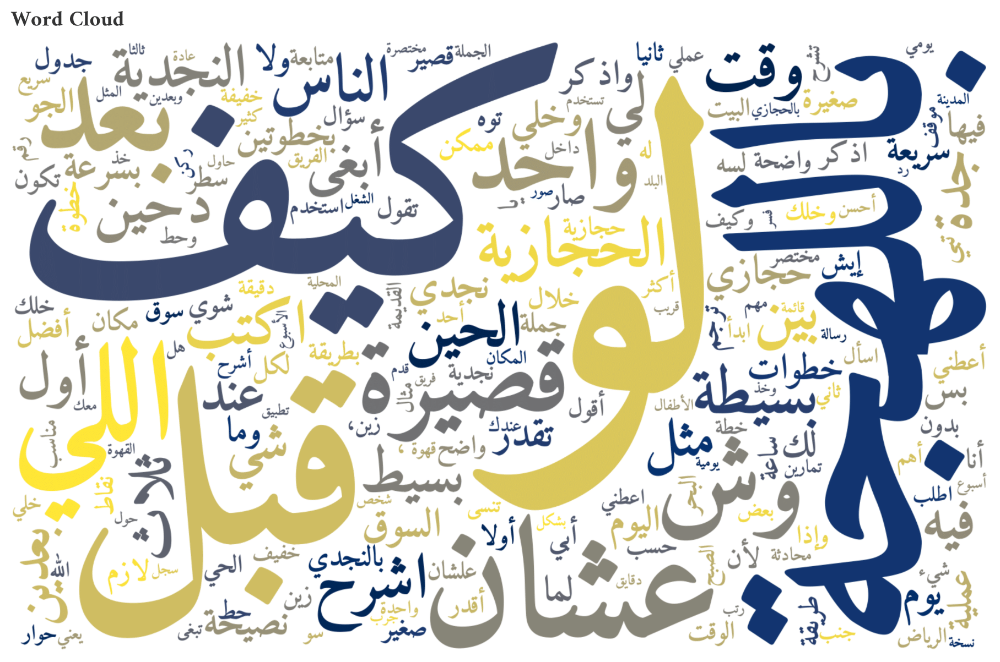

# Saudi-Dialect-ALLaM: LoRA Fine-Tuning for Dialectal Arabic Generation
**Saudi-Dialect-ALLaM** introduces a LoRA fine-tuned version of **ALLaM-7B-Instruct**, specialized for generating text in Saudi dialects (Hijazi & Najdi).
It is the first openly released Saudi dialect generation model, trained on a **balanced 5.5k instruction–response dataset** 
and evaluated with dialect classifiers, fidelity (chrF++, BERTScore), and diversity metrics.  
<p align="center">
  
</p>

---

## Overview
Modern Arabic language models are dominated by **Modern Standard Arabic (MSA)**, with limited support for Saudi dialects such as **Najdi** and **Hijazi**.  
This project introduces:

- **Saudi Dialect Instruction Dataset**: a balanced, synthetic dataset of 5,466 instruction–response pairs (50% Hijazi, 50% Najdi).  
- **Saudi-Dialect-ALLaM**: LoRA fine-tuned versions of **ALLaM-7B-Instruct**, specialized for Saudi dialect generation.  
- **Evaluation Suite**: reproducible benchmarks using external dialect classifiers, fidelity metrics (chrF++, BERTScore), and diversity measures.

Our best LoRA-tuned model with **Dialect Tokens** raises the Saudi rate from **47.9% → 84.2%** while reducing MSA leakage from **32.6% → 6.2%**.

---

## Dataset
- **Total Size:** 5,466 instruction–response pairs  
- **Dialects:** 2,733 Hijazi, 2,733 Najdi  
- **Domains (18):** food, education, careers, shopping, health, technology, culture, entertainment, etc.  
- **Format:** JSONL (`{"instruction": "...", "response": "...", "dialect": "Hijazi/Najdi"}`)  



- Word cloud shows salient Najdi/Hijazi vocabulary (e.g., **كيف**, **اللي**, **عشان**).

---

## Model Usage
You can load the fine-tuned Saudi-Dialect-ALLaM model directly from Hugging Face:
- **Fine-Tuned Model (Hugging Face):**  
  [HassanB4/Saudi-Dialect-ALLaM](https://huggingface.co/HassanB4/Saudi-Dialect-ALLaM)
```python
from transformers import AutoModelForCausalLM, AutoTokenizer
from peft import PeftModel

base_model = "ALLaM-AI/ALLaM-7B-Instruct-preview"
adapter_repo = "HassanB4/Saudi-Dialect-ALLaM-LoRA-Token-Dialect"  # this repo

# Load tokenizer from base (unchanged)
tokenizer = AutoTokenizer.from_pretrained(base_model)

# Load base model
model = AutoModelForCausalLM.from_pretrained(
    base_model,
    device_map="auto",
    torch_dtype="auto"
)

# Apply LoRA adapter
model = PeftModel.from_pretrained(model, adapter_repo)

# Example (Token variant): prepend explicit dialect tag
prompt = "<HIJAZI> اكتبلي رسالة تهنئة لواحد توه متزوج"
inputs = tokenizer(prompt, return_tensors="pt").to(model.device)
outputs = model.generate(**inputs, max_new_tokens=128, temperature=0.7, top_p=0.95)
print(tokenizer.decode(outputs[0], skip_special_tokens=True))
```

---
## Results

### Overall Evaluation

| Model                  | Saudi % ↑ | MSA Leak % ↓ | Low-conf % ↓ | chrF++ ↑ | BERTScore F1 ↑ | distinct-2 ↑ | distinct-3 ↑ | Self-BLEU ↓ |
|-------------------------|-----------|--------------|--------------|----------|----------------|--------------|--------------|-------------|
| **ALLaM-7B (base)**     | 47.97     | 32.63        | 7.18         | 21.27    | 0.6796         | 0.7616       | 0.9142       | 1.70        |
| **LoRA No-Token**       | 80.50     | 9.26         | 4.55         | 23.70    | 0.7377         | 0.9038       | 0.9881       | 0.60        |
| **LoRA Dialect-Token**  | **84.21** | **6.21**     | **4.90**     | **24.80**| **0.7386**     | **0.8875**   | **0.9838**   | **0.66**    |
| Falcon3-7B-Instruct     | 55.62     | 18.80        | 13.52        | 17.81    | 0.6321         | 0.7745       | 0.9073       | 21.85       |
| Llama-3.1-8B-Instruct   | 65.55     | 11.10        | 9.69         | 17.41    | 0.6290         | 0.6605       | 0.7957       | 5.11        |
| Qwen2.5-7B-Instruct     | 50.12     | 7.72         | 13.52        | 19.15    | 0.6327         | 0.6606       | 0.7957       | 6.13        |
| AceGPT-v2-8B-Chat       | 67.94     | 22.02        | 6.94         | 21.59    | 0.6688         | 0.7902       | 0.9409       | 0.31        |
| JAIS-13B-Chat           | 28.83     | 44.27        | 10.41        | 15.95    | 0.6581         | 0.6933       | 0.8087       | 0.35        |

---

✅ **Dialect control:** Dialect-token variant achieves the highest Saudi alignment.  
✅ **Fidelity:** Improves chrF++ and BERTScore over all baselines.  
✅ **Leakage reduction:** MSA output reduced to ~6%.  

