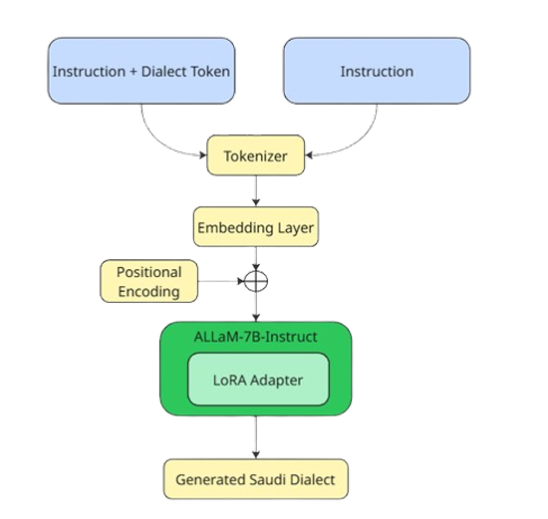

# Saudi-Dialect-ALLaM: LoRA Fine-Tuning for Dialectal Arabic Generation

**Saudi-Dialect-ALLaM** is a **code-only** release showing how to LoRA-tune **ALLaM-7B-Instruct-preview** for Saudi dialect generation (Hijazi & Najdi).  
We provide training / evaluation / inference code, configs, and analysis notebooks.

> **Important:** We do **not** release any dataset, model weights, or LoRA adapters.  
> This repository is intended for researchers to reproduce our pipeline **on their own data**.

<p align="center">
  
</p>

---

## What’s in this repo

- **Training**: LoRA fine-tuning scripts and a config to reproduce our setup.
- **Evaluation**: internal evaluation for ALLaM variants + external evaluation suite (dialect classifier + chrF++ / BERTScore + diversity).
- **Inference**: helpers for prompting a trained checkpoint.
- **Notebooks**: end-to-end training / eval / inference demos and figure generation.
- **Results**: JSON/CSV reports and figures used in the paper.

### Directory structure

```text
.
├─ data/                # small utilities (splits, checks, I/O)
├─ training/            # training loop, LoRA config, CLI
├─ evaluation/
│  ├─ allam_eval/       # eval for ALLaM variants
│  └─ external_eval/    # eval for external baselines + classifier/fidelity/diversity
├─ inference/           # generation helpers and CLI
├─ notebooks/           # Training / Inference / Eval notebooks
└─ results/             # reports + figures used in the paper
```
---
## Prepare your data (schema)

Use your own dataset in **JSON Lines** (`.jsonl`) with the following fields:

```jsonl
{"instruction": "...", "response": "...", "dialect": "HIJAZI"}
{"instruction": "...", "response": "...", "dialect": "NAJDI"}
```
## Formatting regimes

### Dialect-Token
Prepend `<HIJAZI>` or `<NAJDI>` to the instruction at training time.

**Example JSONL:**
```jsonl
{"instruction": "<HIJAZI> ...", "response": "...", "dialect": "HIJAZI"}
{"instruction": "<NAJDI> ...", "response": "...", "dialect": "NAJDI"}
```
### No-Token

Omit explicit tags.

**Example JSONL:**
```jsonl
{"instruction": "...", "response": "...", "dialect": "HIJAZI"}
{"instruction": "...", "response": "...", "dialect": "NAJDI"}
```
> **Tip:** See `data/` utilities and `notebooks/Training-ALLaM-15E.ipynb` for examples of packing, splits **80/10/10**, and max sequence length **2048**.

---
## Results

### Overall Evaluation

| Model                  | Saudi % ↑ | MSA Leak % ↓ | Low-conf % ↓ | chrF++ ↑ | BERTScore F1 ↑ | distinct-2 ↑ | distinct-3 ↑ | Self-BLEU ↓ |
|-------------------------|-----------|--------------|--------------|----------|----------------|--------------|--------------|-------------|
| **ALLaM-7B (base)**     | 47.97     | 32.63        | 7.18         | 21.27    | 0.6796         | 0.7616       | 0.9142       | 1.70        |
| **LoRA No-Token**       | 80.50     | 9.26         | 4.55         | 23.70    | 0.7377         | 0.9038       | 0.9881       | 0.60        |
| **LoRA Dialect-Token**  | **84.21** | **6.21**     | **4.90**     | **24.80**| **0.7386**     | **0.8875**   | **0.9838**   | **0.66**    |
| Falcon3-7B-Instruct     | 55.62     | 18.80        | 13.52        | 17.81    | 0.6321         | 0.7745       | 0.9073       | 21.85       |
| Llama-3.1-8B-Instruct   | 65.55     | 11.10        | 9.69         | 17.41    | 0.6290         | 0.6605       | 0.7957       | 5.11        |
| Qwen2.5-7B-Instruct     | 50.12     | 7.72         | 13.52        | 19.15    | 0.6327         | 0.6606       | 0.7957       | 6.13        |
| AceGPT-v2-8B-Chat       | 67.94     | 22.02        | 6.94         | 21.59    | 0.6688         | 0.7902       | 0.9409       | 0.31        |
| JAIS-13B-Chat           | 28.83     | 44.27        | 10.41        | 15.95    | 0.6581         | 0.6933       | 0.8087       | 0.35        |

---

✅ **Dialect control:** Dialect-token variant achieves the highest Saudi alignment.  
✅ **Fidelity:** Improves chrF++ and BERTScore over all baselines.  
✅ **Leakage reduction:** MSA output reduced to ~6%.  

### Human Evaluation

*Percent of annotator votes; higher is better.*

| Model                 | Dialect % ↑ | Fluency % ↑ | Task % ↑ |
|-----------------------|------------:|------------:|---------:|
| LoRA Dialect-Token    | 68.83       | 74.83       | 91.50    |
| LoRA No-Token         | 66.92       | 72.67       | 88.50    |
| AceGPT-v2-8B-Chat     | 28.67       | 31.50       | 90.17    |
| Llama-3.1-8B-Instruct | 28.17       | 31.25       | 72.92    |

> **Notes:** Dialect-token leads on Dialect and Fluency; AceGPT is relatively strong on Task but weak on Dialect/Fluency.

